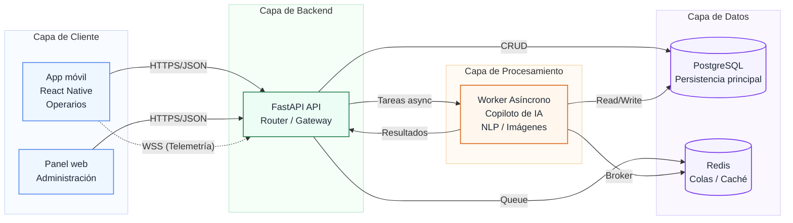
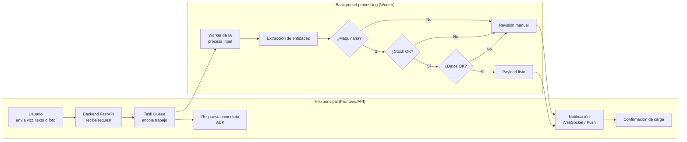
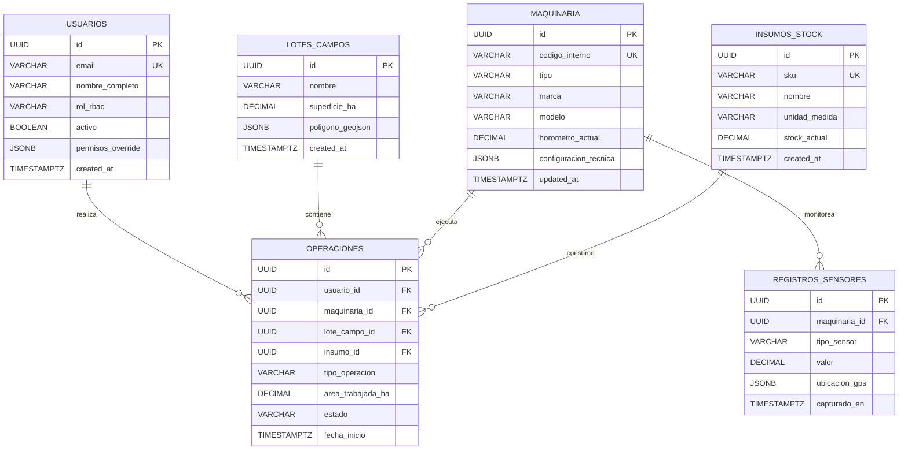
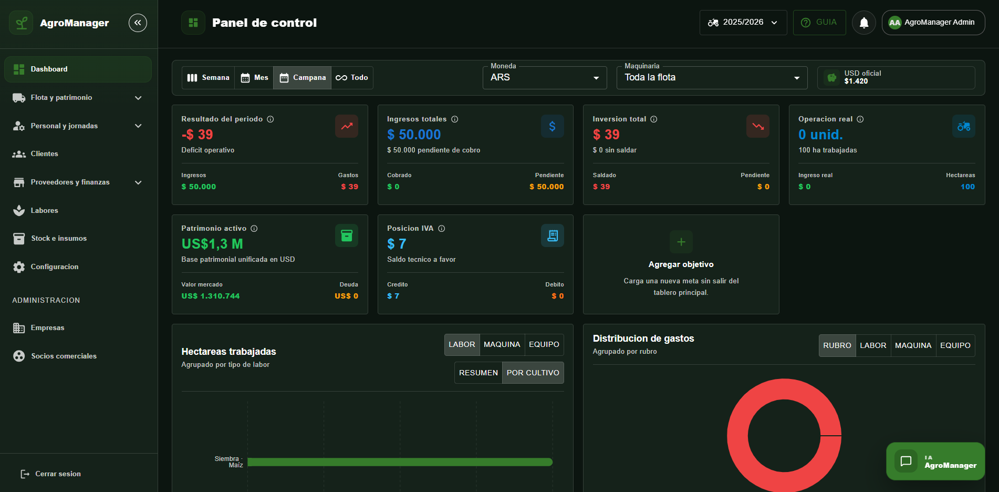
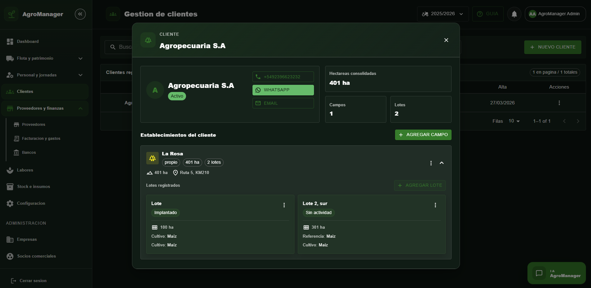
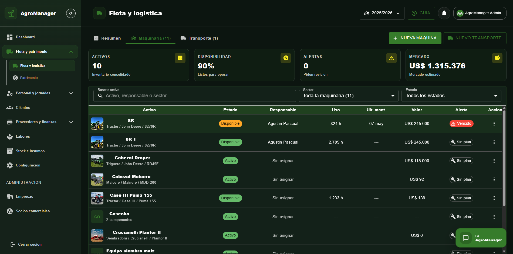
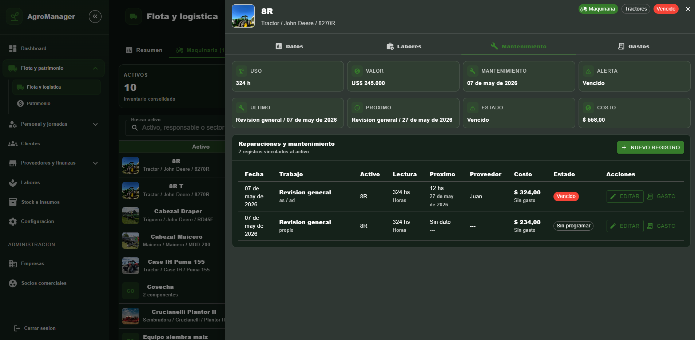

## 🚜 AgroManager

AgroManager es un sistema avanzado de gestión para maquinaria agrícola y operaciones de campo, diseñado para digitalizar la operatividad del agro con una visión integral sobre los procesos críticos del negocio. Su propósito es centralizar el control de stock, la planificación y trazabilidad de labores, el mantenimiento de maquinaria y el seguimiento operativo en tiempo real, transformando flujos manuales y dispersos en una plataforma robusta, auditable y escalable.

Desde una perspectiva de Ingeniería de Sistemas, el principal desafío técnico de AgroManager no es solo modelar la complejidad operativa del entorno agrícola, sino también traducirla en una arquitectura confiable y usable para usuarios de campo. En ese marco, el sistema incorpora un **Copiloto de IA** orientado a la carga asíncrona de datos, la asistencia contextual en procesos operativos y la interpretación de información proveniente de telemetría y sensores, elevando la capacidad de automatización y soporte a la toma de decisiones.

La solución está construida sobre un stack moderno y orientado a rendimiento: **FastAPI** para la capa de servicios, **React Native** para la experiencia móvil multiplataforma y **PostgreSQL** como base de datos transaccional. Este desarrollo colaborativo refleja capacidad para resolver problemas complejos de arquitectura, integración y experiencia de usuario en entornos industriales y agrícolas, donde la confiabilidad operativa, la simplicidad de uso y la escalabilidad técnica son requisitos centrales.

---

#### 🏗️ Arquitectura General del Sistema

#### ⚙️ Flujo de Procesamiento Asíncrono

#### 📊 Modelo de Datos Relacional

#### 📸 Capturas del sistema

##### Dashboard

##### Gestión de clientes

##### Flota y logística

##### Mantenimiento de flota

