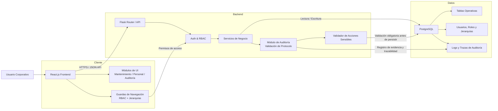
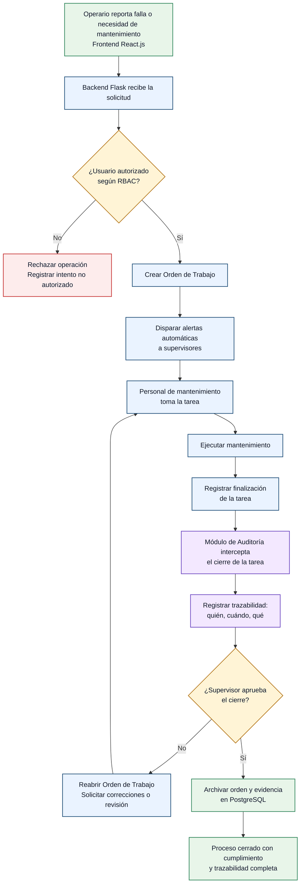
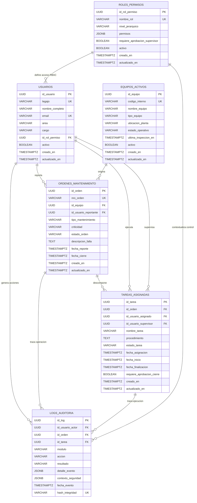
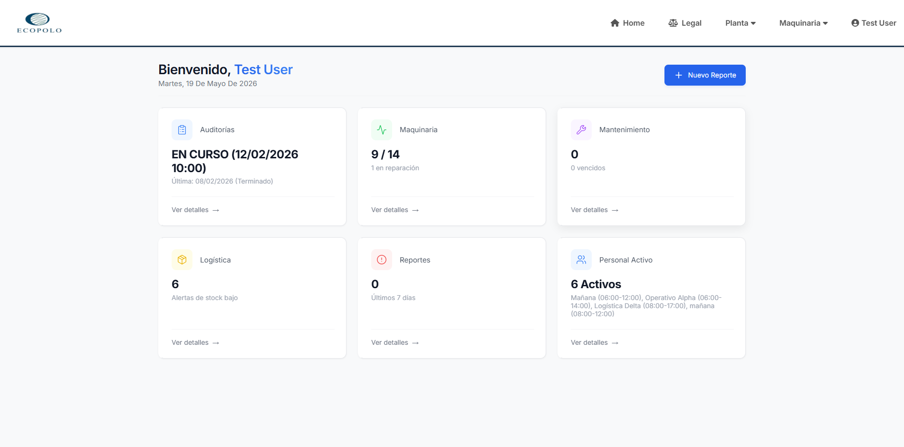
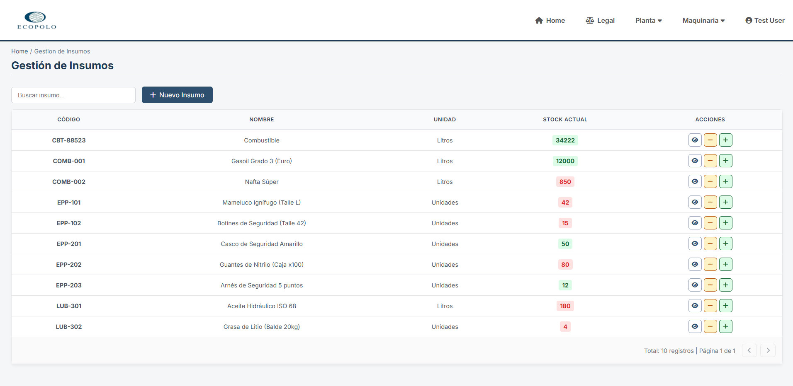
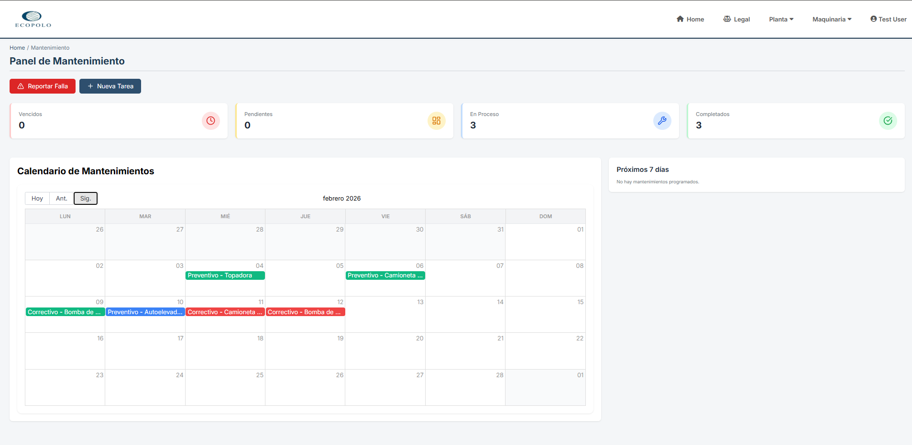
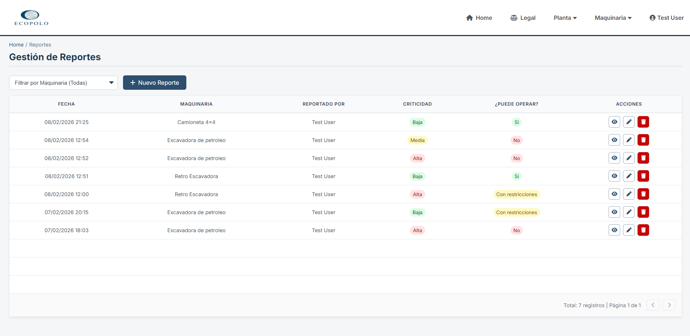

## EcoPolo
EcoPolo es una plataforma corporativa orientada a la gestión de mantenimiento de plantas industriales y a la administración de personal, diseñada para digitalizar procesos internos con foco en seguridad, trazabilidad y control operativo. Su objetivo es centralizar la ejecución y supervisión de tareas críticas del negocio, reduciendo dependencia de circuitos manuales y elevando la consistencia en la operación diaria.

Desde una perspectiva de Ingeniería de Sistemas, el proyecto prioriza una arquitectura B2B robusta, auditable y alineada con entornos donde el cumplimiento de protocolos no es opcional. La solución integra control de acceso basado en roles (RBAC), jerarquías organizacionales y módulos de auditoría que validan acciones sensibles, permitiendo que cada operación quede gobernada por reglas de negocio claras y mecanismos de trazabilidad verificables.

A nivel técnico, EcoPolo se apoya en una arquitectura web desacoplada con React.js en el frontend, Flask/Python como backend API y PostgreSQL como base de datos transaccional. Esta base tecnológica permite construir software empresarial seguro, escalable y preparado para evolucionar sobre procesos internos complejos, donde la observabilidad y la evidencia de cumplimiento son parte central del producto.

### Módulos principales
- `Dashboard operativo`: visión consolidada del estado general, auditorías, maquinaria, logística, reportes y personal activo.
- `Gestión de insumos`: seguimiento de stock actual, unidades, códigos internos y alertas de reposición.
- `Panel de mantenimiento`: calendario de tareas, estados por criticidad y monitoreo de próximos vencimientos.
- `Gestión de reportes`: registro de incidentes o novedades operativas con criticidad y validación de operabilidad.

### Arquitectura de Alto Nivel

### Diagrama de Flujo

### ERD Simplificado (Seguridad y Trazabilidad)

### Capturas de la interfaz

<table>
  <tr>
    <td align="center" width="50%">
      
       
      <strong>Dashboard general</strong>
    </td>
    <td align="center" width="50%">
      
       
      <strong>Gestión de insumos</strong>
    </td>
  </tr>
  <tr>
    <td align="center" width="50%">
      
       
      <strong>Panel de mantenimiento</strong>
    </td>
    <td align="center" width="50%">
      
       
      <strong>Gestión de reportes</strong>
    </td>
  </tr>
</table>
