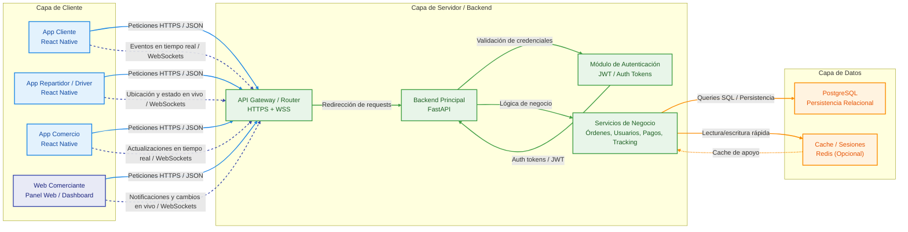

# 🚀 Arquitectura y Ecosistema de Velo

Este documento detalla la arquitectura de software, los flujos críticos de negocio y el modelo de datos que respaldan a Velo. El diseño se centró en la escalabilidad, la baja latencia para eventos en tiempo real y la consistencia transaccional.

---

## 1. Arquitectura Desacoplada de Alto Nivel
El ecosistema de Velo se apoya en una arquitectura cliente-servidor fuertemente desacoplada. Se diseñó para soportar múltiples interfaces de usuario (clientes, comercios y repartidores) comunicándose con un backend centralizado y optimizado.

**Puntos clave del diseño:**
* **Capa Móvil unificada:** Uso de React Native para mantener un desarrollo ágil y consistente en las tres aplicaciones principales.
* **Comunicación Dual:** Integración de peticiones HTTPS para transacciones estándar y WebSockets (WSS) para tracking, ubicación de repartidores y notificaciones de pedidos en vivo.
* **Backend de Alta Concurrencia:** Api desarrollada en FastAPI para aprovechar la asincronía nativa de Python.

## 2. Flujo Crítico y Optimización de Rendimiento
El ciclo de vida de un pedido es el proceso más crítico del sistema. Para garantizar una experiencia fluida, diseñamos una API RESTful escalable e implementamos estrategias de caché tanto del lado del cliente como del servidor, **reduciendo los tiempos de respuesta en un 40%**.

**Resolución de problemas lógicos:**
* **Estrategia de Caché Multinivel:** Validación de catálogo en memoria local de la app y respaldo en Redis, minimizando las consultas (Queries) directas a la base de datos durante la navegación.
* **Matching Engine en Tiempo Real:** Algoritmo de asignación que evalúa la disponibilidad del driver y gestiona *timeouts* (30 segundos por oferta) de forma automatizada.
* **Consistencia de Datos:** Uso de bloqueos transaccionales (Locks) al momento de asignar una orden para evitar condiciones de carrera (Race conditions) si múltiples drivers intentan aceptar simultáneamente.

```mermaid
flowchart LR
  %% Estilos
  classDef client fill:#E3F2FD,stroke:#1E88E5,stroke-width:2px,color:#0D47A1;
  classDef backend fill:#E8F5E9,stroke:#43A047,stroke-width:2px,color:#1B5E20;
  classDef data fill:#FFF3E0,stroke:#FB8C00,stroke-width:2px,color:#E65100;
  classDef merchant fill:#FCE4EC,stroke:#D81B60,stroke-width:2px,color:#880E4F;
  classDef driver fill:#F3E5F5,stroke:#8E24AA,stroke-width:2px,color:#4A148C;
  classDef decision fill:#FFFDE7,stroke:#F9A825,stroke-width:2px,color:#5D4037;
  classDef error fill:#FFEBEE,stroke:#E53935,stroke-width:2px,color:#B71C1C;
  classDef success fill:#E0F2F1,stroke:#00897B,stroke-width:2px,color:#004D40;
  classDef cache fill:#E8F5E9,stroke:#7CB342,stroke-width:2px,color:#33691E;

  %% Cliente
  subgraph CLIENT["Cliente"]
    direction TB
    C0["Cliente abre app Velo"]
    C0A["App valida cache local"]
    C0B["Render de comercios y productos"]
    C1["Cliente confirma carrito"]
    C2["Frontend envía payload de orden"]
    C3["Cliente recibe confirmación / tracking"]
    C4["Cliente recibe error de pago"]
  end

  %% Backend y datos
  subgraph CORE["Backend / Base de Datos"]
    direction TB
    D0{"¿Comercios y productos\nestán en cache local?"}
    B0["Solicitar catálogo inicial al backend"]
    B0A["API Catálogo recibe request"]
    D0A{"¿Catálogo disponible\nen cache servidor?"}
    CACHE1[("Redis / Cache Catálogo\nComercios + Productos")]
    B0B["Responder catálogo desde cache"]
    B0C["Consultar catálogo persistente"]
    DB0[("PostgreSQL\nComercios + Productos")]
    B0D["Hidratar cache y responder catálogo"]

    B1["API Orders recibe request"]
    B2["Validar stock y precios del comercio"]
    B3["Procesar pago en pasarela"]
    D1{"¿Pago aprobado?"}
    B4["Revertir operación y registrar fallo"]
    DB1[("PostgreSQL\nGuardar orden")]
    B5["Crear orden con estado:\nPendiente de Aceptación por Comercio\n/ Buscando Driver"]
    B6["Notificar al comercio para preparación"]
    B7["Matching Engine\nBuscar drivers disponibles\nGeohash / PostGIS"]
    B8["Seleccionar siguiente driver elegible"]
    B9["Enviar oferta en tiempo real\nWebSockets / FCM"]
    B10["Iniciar timeout por driver\n30 segundos"]
    D2{"¿Driver acepta\nantes del timeout?"}
    B11["Marcar driver como omitido\npara esta orden"]
    B12["Reintentar con siguiente driver más cercano"]
    B13["Lock transaccional de la orden\nEvitar race conditions"]
    D3{"¿Orden sigue\nlibre para asignación?"}
    B14["Actualizar estado a Asignada"]
    DB2[("PostgreSQL\nPersistir asignación y driver")]
    B15["Notificar en tiempo real\nal cliente y comercio"]
    B16["Descartar aceptación tardía\n/ orden ya tomada"]
  end

  %% Comercio
  subgraph MERCHANT["Comercio"]
    direction TB
    M1["Comercio recibe aviso\npara preparar pedido"]
    M2["Comercio recibe driver asignado"]
  end

  %% Driver
  subgraph DRIVER["Driver"]
    direction TB
    R1["Driver recibe oferta de pedido"]
    R2{"¿Aceptar oferta?"}
    R3["Driver acepta"]
    R4["Driver rechaza / no responde"]
    R5["Driver recibe confirmación\nde asignación"]
  end

  %% Flujo de carga inicial app
  C0 -->|"Inicio de sesión / apertura app"| C0A
  C0A -->|"Verificar datos locales"| D0
  D0 -->|"Sí, cache local vigente"| C0B
  D0 -->|"No, cache vacío o vencido"| B0
  B0 -->|"HTTPS: pedir comercios y productos"| B0A
  B0A -->|"Buscar catálogo"| D0A
  D0A -->|"Sí, disponible en cache servidor"| B0B
  B0B -->|"Respuesta rápida de catálogo"| C0B
  D0A -->|"No, cache miss"| B0C
  B0C -->|"Queries catálogo"| DB0
  DB0 -->|"Datos persistidos"| B0D
  B0D -->|"Actualizar cache y responder"| CACHE1
  CACHE1 -->|"Payload catálogo"| C0B
  C0B -->|"Cliente navega y arma carrito"| C1

  %% Flujo principal de orden
  C1 -->|"Confirmar compra"| C2
  C2 -->|"HTTPS: payload de orden"| B1
  B1 -->|"Validación de negocio"| B2
  B2 -->|"Monto final validado"| B3
  B3 -->|"Resultado de pasarela"| D1

  D1 -->|"No"| B4
  B4 -->|"Error y reversión"| C4

  D1 -->|"Sí"| B5
  B5 -->|"INSERT orden + estado inicial"| DB1
  DB1 -->|"Orden persistida"| B6
  B6 -->|"Evento de preparación"| M1
  B6 -->|"Disparar búsqueda de repartidor"| B7
  B7 -->|"Ranking por cercanía y disponibilidad"| B8
  B8 -->|"Oferta al mejor candidato"| B9
  B9 -->|"Push / WebSocket"| R1
  R1 -->|"Driver evalúa pedido"| R2
  B9 -->|"Al iniciar oferta"| B10
  B10 -->|"Ventana activa de aceptación"| D2

  %% Resultado driver
  R2 -->|"Aceptar"| R3
  R2 -->|"Rechazar"| R4
  R3 -->|"Respuesta en tiempo real"| D2
  R4 -->|"Rechazo explícito o silencio"| D2

  %% Decisión timeout / aceptación
  D2 -->|"No, rechazo o timeout"| B11
  B11 -->|"Excluir driver para esta orden"| B12
  B12 -->|"Buscar siguiente candidato"| B8

  D2 -->|"Sí, aceptación recibida"| B13
  B13 -->|"Validar exclusión mutua"| D3
  D3 -->|"Sí, aún libre"| B14
  B14 -->|"UPDATE estado = Asignada"| DB2
  DB2 -->|"Asignación confirmada"| B15
  B15 -->|"Tracking en tiempo real"| C3
  B15 -->|"Datos del driver asignado"| M2
  B15 -->|"Confirmación final"| R5

  D3 -->|"No, ya fue tomada"| B16
  B16 -->|"Cerrar intento y continuar lógica"| B12

  %% Clases
  class C0,C0A,C0B,C1,C2,C3,C4 client;
  class B0,B0A,B0B,B0C,B0D,B1,B2,B3,B4,B5,B6,B7,B8,B9,B10,B11,B12,B13,B14,B15,B16 backend;
  class DB0,DB1,DB2 data;
  class CACHE1 cache;
  class M1,M2 merchant;
  class R1,R3,R4,R5 driver;
  class D0,D0A,D1,D2,D3,R2 decision;
  class B4,C4,B16 error;
  class B14,B15,R5,C3,C0B success;

```

## 3. Modelo de Datos Core (ERD)
La base de datos relacional (PostgreSQL) está diseñada para soportar una alta carga transaccional manteniendo la integridad referencial. El siguiente esquema muestra las entidades centrales que orquestan la operatividad diaria.

**Decisiones arquitectónicas:**
* **Gestión de Estados e Históricos:** Uso de timestamps granulares (`fecha_listo`, `fecha_en_camino`, `fecha_entrega`) en la tabla de pedidos para auditoría y métricas de rendimiento.
* **Manejo de Seguridad:** Tokens de actualización (`token_refresh`), tokens push diferenciados y registros de strikes antifraude centralizados en la entidad del usuario.
* **Escalabilidad de Negocio:** Tablas de Comercios y Repartidores vinculadas de forma unívoca a la tabla central de Usuarios, permitiendo una futura expansión de roles (RBAC) sin duplicar datos personales o credenciales.

```mermaid
erDiagram
    usuarios {
        INTEGER id PK
        STRING nombre
        STRING apellido
        STRING email "UK"
        STRING telefono
        STRING mp_customer_id
        STRING google_sub "UK"
        STRING google_email
        STRING google_picture_url
        DATETIME google_linked_at
        DATETIME google_last_login_at
        STRING password_hash
        STRING rol
        INTEGER id_localidad FK
        BOOLEAN activo
        BOOLEAN email_verificado
        BOOLEAN telefono_verificado
        INTEGER intentos_login_fallidos
        INTEGER strikes_fraude
        DATETIME bloqueado_hasta
        DATETIME ultimo_acceso
        TEXT token_refresh
        STRING expo_push_token
        INTEGER token_version
        DATETIME fecha_registro
        DATETIME fecha_actualizacion
    }

    comercios {
        INTEGER id PK
        INTEGER id_usuario FK "UK"
        STRING nombre
        TEXT descripcion
        STRING email "UK"
        STRING telefono
        STRING calle
        STRING numero
        STRING codigo_postal
        STRING provincia
        INTEGER id_localidad FK
        FLOAT latitud
        FLOAT longitud
        STRING logo
        STRING imagen_portada
        INTEGER id_rubro_principal FK
        FLOAT calificacion_promedio
        INTEGER total_calificaciones
        INTEGER tiempo_preparacion_promedio
        FLOAT costo_envio_base
        FLOAT pedido_minimo
        STRING delivery_pricing_mode
        BOOLEAN is_raining_mode_active
        INTEGER pedidos_entregados_total
        FLOAT ingresos_entregados_total
        FLOAT ticket_promedio_total
        INTEGER ticket_promedio_count
        BOOLEAN activo
        BOOLEAN verificado
        BOOLEAN acepta_pedidos
        DATETIME fecha_registro
        DATETIME fecha_actualizacion
        STRING mp_access_token
        STRING mp_user_id
        STRING mp_refresh_token
        BOOLEAN transferencia_alias_habilitada
        FLOAT deuda_pendiente
        STRING cbu_alias
        STRING push_token
    }

    repartidores {
        INTEGER id PK
        INTEGER id_usuario FK "UK"
        INTEGER id_comercio FK
        STRING documento_identidad
        STRING licencia_conducir
        STRING tipo_vehiculo
        STRING marca_modelo
        STRING patente
        BOOLEAN verificado
        BOOLEAN activo
        BOOLEAN disponible
        BOOLEAN en_servicio
        FLOAT calificacion_promedio
        INTEGER total_calificaciones
        INTEGER total_entregas
        INTEGER entregas_exitosas
        INTEGER entregas_canceladas
        FLOAT ganancias_totales
        DATETIME fecha_registro
        DATETIME fecha_actualizacion
    }

    productos {
        INTEGER id PK
        INTEGER id_comercio FK
        INTEGER id_categoria FK
        STRING nombre
        TEXT descripcion
        FLOAT precio
        STRING imagen
        INTEGER stock_disponible
        INTEGER stock_minimo
        BOOLEAN disponible
        BOOLEAN activo
        BOOLEAN destacado
        BOOLEAN is_delivery_available
        BOOLEAN is_takeaway_available
        JSON extras
        STRING tipo
        INTEGER max_gustos
        INTEGER id_categoria_gustos
        INTEGER minimo_compra
        DATETIME fecha_creacion
        DATETIME fecha_actualizacion
        INTEGER id_producto_x_opcion FK
    }

    pedidos {
        INTEGER id PK
        INTEGER id_usuario FK
        INTEGER id_comercio FK
        INTEGER id_repartidor FK
        INTEGER id_direccion_entrega FK
        INTEGER id_promocion FK
        INTEGER id_cupon FK
        STRING numero_pedido "UK"
        STRING estado
        STRING order_type
        STRING codigo_entrega
        STRING device_id
        FLOAT subtotal
        FLOAT costo_envio
        FLOAT descuento
        FLOAT total
        FLOAT comision_velo_snapshot
        TEXT observaciones
        TEXT motivo_cancelacion
        BOOLEAN es_pedido_falso
        JSON detalles_promocion
        INTEGER tiempo_estimado_preparacion
        INTEGER tiempo_estimado_entrega
        DATETIME fecha_pedido
        DATETIME fecha_confirmacion
        DATETIME fecha_listo
        DATETIME fecha_en_camino
        DATETIME fecha_entrega
        INTEGER duracion_real_entrega_minutos
        DATETIME estadisticas_entrega_aplicadas_at
        DATETIME fecha_cancelacion
        FLOAT latitud_cancelacion
        FLOAT longitud_cancelacion
        BOOLEAN alerta_5min_enviada
        BOOLEAN alerta_10min_enviada
    }

    pagos {
        INTEGER id PK
        INTEGER id_pedido FK
        STRING metodo_pago
        STRING estado
        FLOAT monto
        STRING moneda
        STRING payment_id_externo
        INTEGER verificado_por_usuario_id FK
        DATETIME fecha_verificacion
        TEXT motivo_rechazo
        DATETIME fecha_creacion
        DATETIME fecha_aprobacion
        DATETIME fecha_rechazo
    }

    usuarios ||--o| comercios : "opera"
    usuarios ||--o| repartidores : "representa"
    usuarios ||--o{ pedidos : "realiza"
    usuarios ||--o{ pagos : "verifica"
    comercios ||--o{ productos : "ofrece"
    comercios ||--o{ repartidores : "coordina"
    comercios ||--o{ pedidos : "recibe"
    repartidores ||--o{ pedidos : "toma"
    pedidos ||--o{ pagos : "registra"

```

**Stack Tecnológico Principal:**

